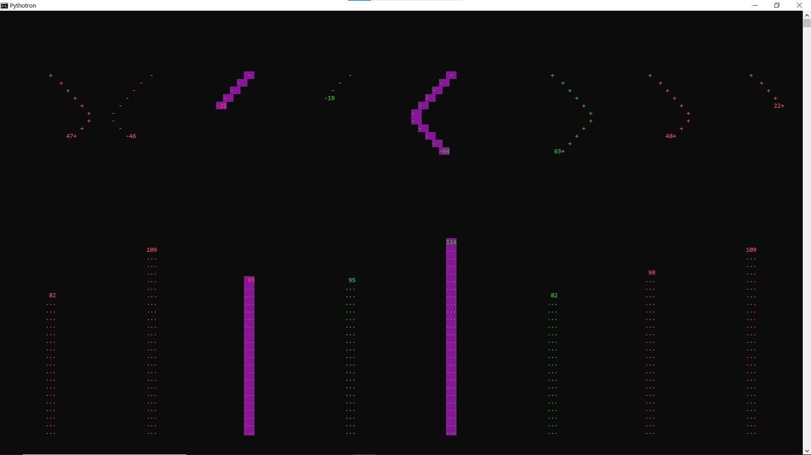

# A simple midi audiovisual monitor

Default setup for KORG nanoKONTROL2

Note: Set LED Mode to "External" in KORG KONTROL Editor for better effect. Otherwise change external_led_mode to: False

Press "h" for help